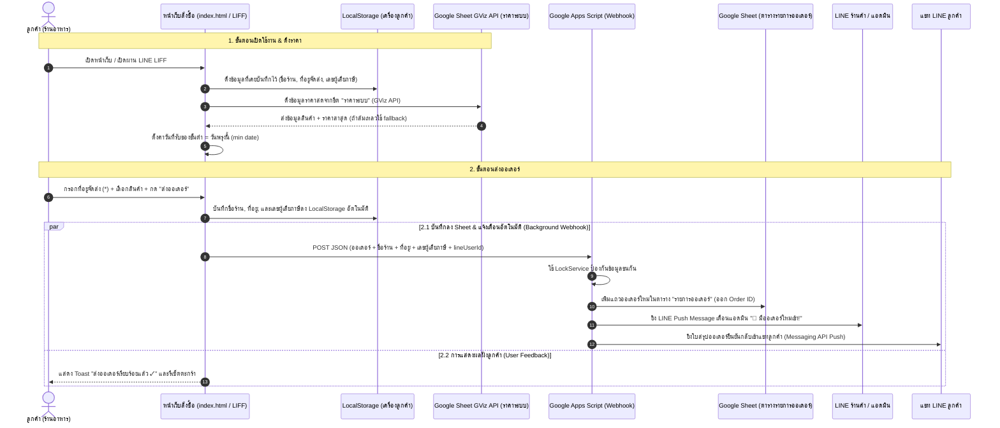

# 🥬 ระบบสั่งผัก-ผลไม้ออนไลน์ (ร้านสวนผักสด)

เว็บแอปพลิเคชันสำหรับสั่งผักและผลไม้สดสำหรับลูกค้าประจำ (ร้านอาหาร/ร้านค้า) ดึงราคาสดจาก Google Sheet อัตโนมัติ พร้อมระบบบันทึกออเดอร์ลงตาราง แจ้งเตือนแอดมินผ่าน LINE ร้านค้า และส่งข้อความยืนยันสั่งซื้อกลับเข้าแชท LINE ลูกค้าผ่าน **LINE LIFF & Messaging API** ครบวงจร

---

## 🔗 ลิงก์และข้อมูลคอนฟิกสำคัญ (Key Links & Configs)

* **เว็บไซต์เปิดใช้งานจริง (GitHub Pages)**: [https://fang14298.github.io/produce-order/](https://fang14298.github.io/produce-order/)
* **ลิงก์สั่งซื้อผ่าน LINE LIFF**: [https://liff.line.me/2011037440-PBPwdRGn](https://liff.line.me/2011037440-PBPwdRGn)
* **LINE Official Account (ร้านค้า)**: `@746wpose`
* **Google Sheet ID**: `1ihPCg3VKhS59B5RrlKuvFZi9IsZesESkXmrb02cS-84`
  * [เปิดดู Google Sheet](https://docs.google.com/spreadsheets/d/1ihPCg3VKhS59B5RrlKuvFZi9IsZesESkXmrb02cS-84/edit) (ตั้งค่าเป็น *"ทุกคนที่มีลิงก์ - ผู้มีสิทธิ์ดู"*)
* **LIFF ID**: `2011037440-PBPwdRGn`
* **Google Apps Script Webhook URL**: `https://script.google.com/macros/s/AKfycbxQ-_TdgdewOhf2f1El9RkjAXcu9DYZMJyQhMNR8gyiQZ96Ce6XD2szlA4wH4nY1bp_Xw/exec`

---

## ⚡ สถาปัตยกรรมและการทำงานของระบบ (System Architecture)



---

## ✨ ฟีเจอร์เด่นและกฎทางธุรกิจ (Features & Business Rules)

### 1. การทำงานฝั่งลูกค้า (Customer Experience)
* **ระบบจำข้อมูลลูกค้า (LocalStorage)**:
  * **ชื่อร้าน / ลูกค้า (`*`)**: บังคับกรอก และจำลง `localStorage` (`produce_order_shop_name`)
  * **เบอร์โทรศัพท์ (`*`)**: บังคับกรอก และจำลง `localStorage` (`produce_order_phone`) เพื่อให้แอดมินโทรติดต่อได้ทันที
  * **ที่อยู่จัดส่ง (`*`)**: บังคับกรอกละเอียด และจำลง `localStorage` (`produce_order_address`) เพื่อความสะดวกในการสั่งซื้อครั้งถัดไป
  * **เลขประจำตัวผู้เสียภาษี**: ไม่บังคับกรอก แต่หากกรอกไว้ ระบบจะจำลง `localStorage` (`produce_order_tax_id`) อัตโนมัติ (หากลบออก ระบบจะลบออกจากความจำ)
* **ระบบจำกัดวันที่รับของอัตโนมัติ**:
  * ตั้งค่าวันที่รับของขั้นต่ำ (`min`) เป็น **วันพรุ่งนี้** เป็นต้นไป (ห้ามเลือกวันนี้หรือย้อนหลัง)
  * มี Event Listener ดักจับกรณีเบราว์เซอร์บางรุ่น (เช่น iOS Safari) ที่ผู้ใช้กดเลือกวันที่ย้อนหลังได้ โดยระบบจะเตือน Toast และปรับกลับมาเป็นวันพรุ่งนี้ให้อัตโนมัติ
* **ดึงราคาสดจาก Google Sheet 100% (Single Source of Truth via GViz API)**:
  * หน้าเว็บดึงราคา หมวดหมู่ หน่วย และสเต็ปส่วนเพิ่มล่าสุดจากชีต `"ราคาระบบ"` ผ่าน Google Visualization API (`gviz/tq`)
  * ปลดล็อกข้อจำกัดโค้ด ให้แก้ไข/เพิ่ม/ลบรายการสินค้าใน Google Sheet ได้ทันทีโดยไม่ต้องแก้โค้ด HTML
* **ประสบการณ์การใช้งานบนมือถือสำหรับสินค้าจำนวนมาก (200+ Items Mobile UX)**:
  * **ระบบค้นหาอัจฉริยะ (Smart Search)**: ช่องค้นหาคงที่พร้อมปุ่ม `✕` เคลียร์ข้อความค้นหาใน 1-tap และบอกจำนวนผลลัพธ์ที่พบทันที
  * **เมนูดร็อปดาวน์ทางด่วน (Category Jump Dropdown)**: เลือกสลับหมวดหมู่สินค้าได้ทันทีโดยไม่ต้องไถสไลด์ยาว
  * **หัวข้อหมวดหมู่พับเปิด-ปิดได้ (Collapsible Category Accordions)**: กดที่หัวข้อหมวดเพื่อพับเก็บ/ขยายดูสินค้า พร้อม Badge แสดงจำนวนสินค้าในหมวด
  * **ปุ่มกรอง "🛒 เลือกแล้ว"**: ปุ่มทางด่วนสำหรับกรองดูเฉพาะสินค้าที่ถูกเลือกใส่ตะกร้าไว้ ช่วยให้ตรวจทานสินค้าที่สั่งซื้อได้สะดวกยิ่งขึ้น
* **บูรณาการ LINE LIFF**:
  * เมื่อเปิดผ่าน LINE LIFF ระบบจะดึงโปรไฟล์ลูกค้า (`lineUserId`, `displayName`) เพื่อใช้อ้างอิงและยิงข้อความทวนรายการสินค้ากลับเข้าแชท LINE ของลูกค้าโดยตรง

* **ระบบสร้างและพิมพ์ใบส่งสินค้า / ใบแจ้งหนี้ (Invoice PDF & Print)**:
  * ออกแบบจัดวางตามแบบมาตรฐาน (สไตล์ Makro) สวยงาม เป็นระเบียบ พร้อมโลโก้ร้าน ข้อมูลติดต่อ ข้อมูลลูกค้า ตารางรายการสินค้า ยอดสรุปสุทธิ และช่องเซ็นชื่อผู้จัดส่ง/ผู้รับสินค้า
  * รองรับการสั่งพิมพ์ออกเครื่องพิมพ์ หรือกดบันทึกเป็นไฟล์ PDF ได้ทันทีด้วย 1-Click
* **ระบบสร้าง PromptPay Dynamic QR Code ล็อกยอดเงินสด**:
  * คำนวณรหัสมาตรฐาน EMVCo PromptPay Payload ออฟไลน์โดยอัตโนมัติด้วยเบอร์ PromptPay `093-3121105` (ชื่อบัญชี: *นางสาวชวัลลักษณ์ ไพบูลย์ชมพู*)
  * เมื่อลูกค้าหรือแอดมินเปิดดูใบแจ้งหนี้ ระบบจะสร้างรูป QR Code สแกนจ่ายเงินที่มี **ยอดเงินออเดอร์นั้นๆ ระบุไว้อัตโนมัติ (เช่น 75.00 บาท)** สแกนแล้วยอดเงินขึ้นทันทีโดยไม่ต้องพิมพ์ยอดเงินเอง
* **ระบบบันทึกออเดอร์รวมศูนย์ (ล่าสุดอยู่บนสุด)**: บันทึกออเดอร์ลงตาราง `"รายการออเดอร์"` ใน Google Sheet โดยแทรกรายการใหม่อยู่ที่ **แถวบนสุด (แถวที่ 2)** อัตโนมัติ เพื่อให้แอดมินเห็นออเดอร์ล่าสุดได้ทันทีโดยไม่ต้องไถลงล่าง พร้อมสร้าง Order ID ในรูปแบบ `ORD-YYYYMMDD-HHmmss`
* **การเปลี่ยนสถานะแบบดร็อปดาวน์ & แจ้งเตือน LINE อัตโนมัติ (`onEditStatus`)**: แอดมินเลือกเปลี่ยนสถานะในคอลัมน์ J แล้วระบบจะยิงแชท LINE Push Message แจ้งลูกค้าอัตโนมัติ Real-time
* **การป้องกันข้อมูลชนกัน (Concurrency Control)**: โค้ด Google Apps Script ใช้ `LockService.getScriptLock()` ป้องกันออเดอร์สูญหายเมื่อมีลูกค้าสั่งเข้ามาพร้อมกัน
* **การแจ้งเตือน 2 ทาง (Dual Push Notification)**:
  1. แจ้งเตือนแอดมินร้านค้าผ่าน LINE Messaging API Push (หรือ LINE Notify) รวมข้อมูลที่อยู่จัดส่งและเลขผู้เสียภาษี
  2. แจ้งเตือนลูกค้าด้วยการส่งใบทวนออเดอร์เข้าแชท LINE ของลูกค้าโดยตรง
* **กฎกติการ้านค้า**:
  * **เวลาตัดออเดอร์**: สั่งก่อน **19:00 น.** — จัดส่งเช้าวันถัดไป
  * **เงื่อนไขค่าจัดส่ง**: **ส่งฟรีในระยะ 10 กิโลเมตร**
  * **การแสดงผล**: ล็อกธีมสว่าง (`color-scheme: light only`) คอนทราสต์สูง อ่านง่าย สบายตา

---

## 📊 โครงสร้าง Google Sheet (3 ชีตหลัก)

### 1. ชีต `"ราคาระบบ"` (สินค้าและราคาหลัก)
* **หน้าที่**: เป็นฐานข้อมูลราคาสินค้าที่หน้าเว็บจะดึงไปแสดงผล
* **โครงสร้างคอลัมน์**:
  | คอลัมน์ | ชื่อหัวตาราง | รายละเอียด / ตัวอย่าง |
  | :---: | :--- | :--- |
  | A | หมวดหมู่ | ผักใบ, ผักหัว-ผล, พริก-เครื่องแกง, เห็ด, ผลไม้ |
  | B | ชื่อสินค้า | คะน้า, มะเขือเทศ, มะนาว |
  | C | ราคา | 40 (บาท) |
  | D | หน่วย | กก., ลูก, หวี, แพ็ค |
  | E | ส่วนเพิ่ม | 0.5 (สเต็ปการกดเพิ่ม/ลด เช่น ครั้งละ 0.5 กก.) |

### 2. ชีต `"ตารางลูกค้า"`
* **หน้าที่**: จัดรูปแบบตารางสำหรับ Export เป็น PDF แจ้งราคาประจำวันให้ลูกค้า

### 3. ชีต `"รายการออเดอร์"` (บันทึกอัตโนมัติจาก Webhook)
* **หน้าที่**: บันทึกประวัติและรายละเอียดการสั่งซื้อทั้งหมด (สร้างชีตและจัดสไตล์หัวตารางอัตโนมัติหากยังไม่มี)
* **โครงสร้างคอลัมน์ (A-K)**:
  | คอลัมน์ | ชื่อหัวตาราง | ตัวอย่างข้อมูล |
  | :---: | :--- | :--- |
  | A | เลขที่ออเดอร์ | `ORD-20260810-093000` |
  | B | วัน-เวลาสั่งซื้อ | `10/08/2026 09:30:00` |
  | C | ชื่อร้าน / ลูกค้า | `ครัวริมปิง` |
  | D | ที่อยู่จัดส่ง | `123/45 ถ.สุขุมวิท แขวงคลองเตย เขตคลองเตย กทม. 10110` |
  | E | เลขผู้เสียภาษี | `0105551234567` (หรือ `-`) |
  | F | วันที่รับของ | `2026-08-11` |
  | G | รายการสินค้าที่สั่ง | `• คะน้า 2 กก. = 80 บาท\n• มะนาว 10 ลูก = 30 บาท` |
  | H | ยอดรวม (บาท) | `110` |
  | I | หมายเหตุ | `ขอมะเขือเทศลูกแข็ง` |
  | J | สถานะ | `รอยืนยัน` |
  | K | LINE User ID | `U1234567890abcdef...` |

---

## 📡 โครงสร้างข้อมูล JSON Payload (API Contract)

เมื่อผู้ใช้กด "ส่งออเดอร์" หน้าเว็บจะส่ง HTTP POST Request ไปยัง `SHEET_WEBHOOK_URL` ด้วยโครงสร้าง JSON ดังนี้:

### HTTP Request Payload (`POST`)
```json
{
  "shop": "ครัวริมปิง",
  "address": "123/45 ถ.สุขุมวิท แขวงคลองเตย เขตคลองเตย กทม. 10110",
  "taxId": "0105551234567",
  "date": "2026-08-11",
  "note": "ขอมะเขือเทศลูกแข็ง / แบ่งถุงละ 2 กก.",
  "totalAmount": 110,
  "items": [
    { "name": "คะน้า", "qty": 2, "unit": "กก.", "price": 40, "subtotal": 80 },
    { "name": "มะนาว", "qty": 10, "unit": "ลูก", "price": 3, "subtotal": 30 }
  ],
  "itemsSummary": "• คะน้า 2 กก. = 80 บาท\n• มะนาว 10 ลูก = 30 บาท",
  "lineUserId": "U1234567890abcdef1234567890abcdef",
  "lineDisplayName": "Somchai_Restaurant"
}
```

### HTTP Response (JSON)
```json
{
  "result": "success",
  "orderId": "ORD-20260810-093000"
}
```

---

## 🛠️ ขั้นตอนการตั้งค่าและการ Deploy (Deployment Guide)

### 1. การอัปเดต Google Apps Script ใน Google Sheet
1. เปิด Google Sheet ของร้าน
2. ไปที่ **ส่วนขยาย (Extensions)** > **Apps Script**
3. คัดลอกโค้ดจากไฟล์ [`examples/google-apps-script.gs`](file:///C:/Users/fang0/produce-order/examples/google-apps-script.gs) ไปวางทับใน `Code.gs`
4. กำหนดค่าตัวแปรในสคริปต์:
   * `LINE_CHANNEL_ACCESS_TOKEN`: วาง Channel Access Token จาก LINE Developers Console
   * `ADMIN_LINE_USER_ID`: วาง LINE User ID ของแอดมินร้านค้าที่จะให้รับแจ้งเตือน
5. กด **ทำให้ใช้งานได้ (Deploy)** > **จัดการการทำให้ใช้งานได้ (Manage Deployments)**
6. กดไอคอน **ดินสอ (Edit)** -> เลือกเวอร์ชันเป็น **"เวอร์ชันใหม่" (New version)** -> กด **ทำให้ใช้งานได้ (Deploy)**

### 1.1 การตั้งค่าทริกเกอร์แจ้งเตือน LINE อัตโนมัติเมื่อแอดมินเปลี่ยนสถานะ (Status Change Trigger)
เพื่อให้ระบบยิง LINE Push Message หาแนะเตือนลูกค้าอัตโนมัติทันทีที่แอดมินเปลี่ยนสถานะในคอลัมน์ J (`สถานะ`):
1. ในหน้า Apps Script ให้คลิกเมนูด้านซ้ายเลือกไอคอนรูปนาฬิกา **ทริกเกอร์ (Triggers)**
2. กดปุ่ม **+ เพิ่มทริกเกอร์ (+ Add Trigger)** ด้านขวาล่าง
3. เลือกฟังก์ชั่นที่จะรัน: **`onEditStatus`**
4. เลือกประเภทเหตุการณ์: **เมื่อมีการแก้ไข (On edit)**
5. กด **บันทึก (Save)** (หากมีป๊อบอัพขอสิทธิ์การเข้าถึง ให้กดยืนยันสิทธิ์ Allow/Advance)

> 💡 **ข้อควรระวังในการทดสอบโค้ดใน Apps Script**:
> หากต้องการทดสอบรันสคริปต์ในหน้า Apps Script ให้เลือกฟังก์ชั่น **`testDoPost`** หรือ **`testOnEditStatus`** แล้วกด **"เรียกใช้ (Run)"** (ห้ามเลือก `doPost` โดยตรง เพราะ `doPost(e)` รับค่าพารามิเตอร์ `e.postData` จากคำขอ HTTP Webhook ของหน้าเว็บ)

### 2. การอัปเดตค่าคอนฟิกในหน้าเว็บ ([`index.html`](file:///C:/Users/fang0/produce-order/index.html))
ตรวจสอบและตั้งค่าตัวแปรในส่วน `<script>` ของ `index.html`:
```javascript
const SHEET_ID = "1ihPCg3VKhS59B5RrlKuvFZi9IsZesESkXmrb02cS-84";
const SHEET_WEBHOOK_URL = "https://script.google.com/macros/s/.../exec";
const LIFF_ID = "2011037440-PBPwdRGn";
```

---

## 📁 โครงสร้างไฟล์ในโปรเจกต์ (Project Structure)

```text
produce-order/
├── index.html                       # โค้ดหน้าเว็บสั่งซื้อหลัก (HTML + CSS + Vanilla JS + LIFF SDK)
├── README.md                        # เอกสารอธิบายภาพรวมและคู่มือระบบ (ฉบับสมบูรณ์)
├── .agents/
│   └── AGENTS.md                    # กฎการทำงานของ AI (บังคับอัปเดตเอกสารทุกครั้งหลังแก้ไขโค้ด)
├── examples/
│   ├── google-apps-script.gs        # โค้ด Google Apps Script สำหรับจัดการ Webhook & LINE Messaging API
│   └── order-sample.json            # ตัวอย่างโครงสร้างข้อมูล JSON Payload ออเดอร์
└── docs/
    └── superpowers/
        ├── specs/                   # เอกสารสเปกการออกแบบระบบ (Design Specifications)
        └── plans/                   # เอกสารแผนการพัฒนา (Implementation Plans)
```

---

## 📝 กฎการดูแลเอกสารประจำโปรเจกต์ (Documentation Policy)

ตามข้อกำหนดใน `.agents/AGENTS.md`:
* **ทุกครั้งที่มีการแก้ไข เพิ่มเติมฟีเจอร์ หรือปรับปรุงโครงสร้างโค้ด**: จะต้องทำการอัปเดตเอกสาร (`README.md`, `specs`, `plans`) ให้ละเอียด ครอบคลุม และตรงกับโค้ดล่าสุดทันทีเสมอ