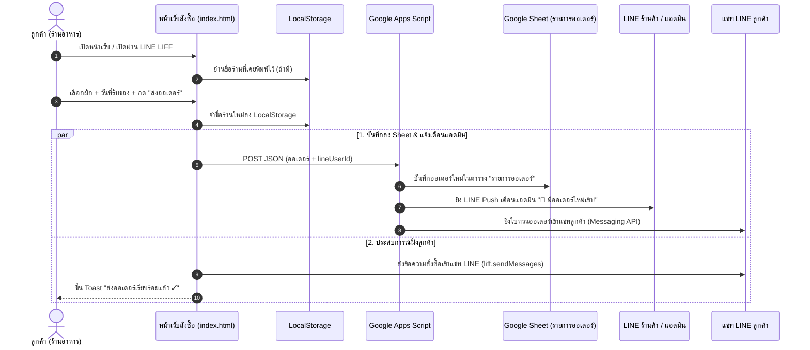

# 🥬 ระบบสั่งผัก-ผลไม้ออนไลน์ (ร้านสวนผักสด)

เว็บแอปพลิเคชันสำหรับสั่งผักและผลไม้สดสำหรับลูกค้าประจำ (ร้านอาหาร/ร้านค้า) ดึงราคาสดจาก Google Sheet อัตโนมัติ พร้อมระบบบันทึกออเดอร์ลงตาราง และส่งข้อความยืนยันสั่งซื้อผ่าน **LINE LIFF & Messaging API** ครบวงจร

---

## 🔗 ลิงก์และข้อมูลคอนฟิกสำคัญ

* **เว็บไซต์เปิดใช้งานจริง (GitHub Pages)**: [https://fang14298.github.io/produce-order/](https://fang14298.github.io/produce-order/)
* **ลิงก์สั่งซื้อผ่าน LINE LIFF**: [https://liff.line.me/2011037440-PBPwdRGn](https://liff.line.me/2011037440-PBPwdRGn)
* **LINE OA ร้านค้า**: `@746wpose`
* **Google Sheet ID**: `1ihPCg3VKhS59B5RrlKuvFZi9IsZesESkXmrb02cS-84`
  * [เปิดดู Google Sheet](https://docs.google.com/spreadsheets/d/1ihPCg3VKhS59B5RrlKuvFZi9IsZesESkXmrb02cS-84/edit) (ตั้งค่าเป็น *"ทุกคนที่มีลิงก์ - ผู้มีสิทธิ์ดู"*)
* **LIFF ID**: `2011037440-PBPwdRGn`
* **Google Apps Script Webhook URL**: `https://script.google.com/macros/s/AKfycbxQ-_TdgdewOhf2f1El9RkjAXcu9DYZMJyQhMNR8gyiQZ96Ce6XD2szlA4wH4nY1bp_Xw/exec`

---

## ⚡ สรุปฟีเจอร์และการทำงานของระบบ (System Workflow)



### 1. การทำงานฝั่งลูกค้า (Customer Experience)
* **จำชื่อร้านค้า (LocalStorage)**: พิมพ์ชื่อร้านครั้งแรก ระบบจะบันทึกจำไว้ในเครื่อง วันหลังเปิดมาสั่งไม่ต้องพิมพ์ซ้ำ
* **จำกัดวันที่รับของ**: ตั้งค่าขั้นต่ำให้เลือกได้ตั้งแต่ **วันพรุ่งนี้เป็นต้นไป** (ห้ามเลือกวันนี้/ย้อนหลัง มีระบบตรวจสอบและเปลี่ยนให้อัตโนมัติหากเลือกผิด)
* **บังคับชื่อร้าน**: ช่องชื่อร้านเป็นช่องบังคับ (`*`)
* **ส่งออเดอร์ในปุ่มเดียว**: กดปุ่มเดียว ระบบจะบันทึกออเดอร์ลง Google Sheet + ส่งใบทวนรายการเข้าแชท LINE ลูกค้า + แจ้งเตือน LINE ร้านค้าทันที

### 2. การทำงานฝั่งร้านค้า (Admin Experience)
* **ออเดอร์ไม่ตกหล่น**: ออเดอร์ทั้งหมดถูกจดลงตาราง `"รายการออเดอร์"` ใน Google Sheet จัดระเบียบอัตโนมัติ
* **เสียงเตือน LINE เรียลไทม์**: มีออเดอร์เข้าปุ๊บ ข้อความสรุปจะเด้งเข้า LINE ร้านค้าทันที
* **ปรับราคาสดได้ทุกวัน**: แก้ราคาในชีต `"ราคาระบบ"` หน้าเว็บจะอัปเดตราคาใหม่ทันที

---

## 📊 โครงสร้าง Google Sheet (3 ชีตหลัก)

1. **ชีต "ราคาระบบ"**: ต้นทางราคาที่เว็บแอปดึงไปใช้ (คอลัมน์: `หมวดหมู่ | ชื่อสินค้า | ราคา | หน่วย | ส่วนเพิ่ม`)
2. **ชีต "ตารางลูกค้า"**: ตาราง 2 บล็อกวางคู่กันสำหรับ Export เป็น PDF แจ้งราคาประจำวันให้ลูกค้า
3. **ชีต "รายการออเดอร์"**: ตารางบันทึกออเดอร์ที่สั่งเข้ามาจากหน้าเว็บโดยอัตโนมัติ
   * **คอลัมน์**: `เลขที่ออเดอร์ | วัน-เวลาสั่งซื้อ | ชื่อร้าน / ลูกค้า | วันที่รับของ | รายการสินค้าที่สั่ง | ยอดรวม (บาท) | หมายเหตุ | สถานะ | LINE User ID`

---

## 🛠️ ขั้นตอนการอัปเดต Google Apps Script ใน Google Sheet

เมื่อมีการแก้ไขหรือติดตั้งสคริปต์ ให้ทำตามขั้นตอนดังนี้:

1. เปิด Google Sheet ของร้าน
2. ไปที่ **ส่วนขยาย (Extensions)** > **Apps Script**
3. คัดลอกโค้ดจากไฟล์ [`examples/google-apps-script.gs`](file:///C:/Users/fang0/produce-order/examples/google-apps-script.gs) นำไปวางทับในไฟล์ `Code.gs` ทั้งหมด
4. กดปุ่ม **ทำให้ใช้งานได้ (Deploy)** > **จัดการการทำให้ใช้งานได้ (Manage Deployments)**
5. กดไอคอน **ดินสอ (Edit)** -> ตรงเวอร์ชันเลือก **"เวอร์ชันใหม่" (New version)** -> กด **ทำให้ใช้งานได้ (Deploy)**

---

## 📁 โครงสร้างไฟล์ในโปรเจกต์ (Project Structure)

```text
produce-order/
├── index.html                       # โค้ดหน้าเว็บสั่งซื้อหลัก (HTML + CSS + Vanilla JS + LIFF SDK)
├── README.md                        # เอกสารอธิบายภาพรวมและคู่มือระบบ
├── examples/
│   ├── google-apps-script.gs        # โค้ด Google Apps Script ฉบับเต็มสำหรับใส่ใน Google Sheet
│   └── order-sample.json            # ตัวอย่างโครงสร้างข้อมูล JSON ออเดอร์
└── docs/
    superpowers/
    ├── specs/                       # เอกสารสเปกการออกแบบระบบ (Design Specification)
    └── plans/                       # เอกสารแผนการพัฒนา (Implementation Plan)
```

---

## 📜 กติกาและเงื่อนไขของร้าน (Business Rules)

* **เวลาตัดออเดอร์**: สั่งก่อน **19:00 น.** — จัดส่งเช้าวันถัดไป
* **เงื่อนไขค่าจัดส่ง**: **ส่งฟรีในระยะ 10 กิโลเมตร**
* **ธีมหน้าเว็บ**: ล็อกธีมสว่าง (`color-scheme: light only`) อ่านง่าย ชัดเจน