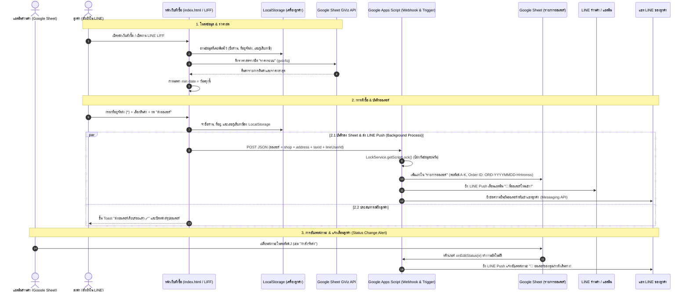

# Design Spec: ระบบบันทึกออเดอร์ Google Sheet & LINE LIFF + Messaging API

**วันที่ออกแบบ**: 9 สิงหาคม 2026  
**อัปเดตล่าสุด**: 10 สิงหาคม 2026 (เพิ่มระบบทริกเกอร์แจ้งเตือน LINE อัตโนมัติเมื่อแอดมินเปลี่ยนสถานะออเดอร์ใน Google Sheet via `onEditStatus`)  
**โปรเจกต์**: ระบบสั่งผัก-ผลไม้ออนไลน์ (ร้านสวนผักสด) — `Fang14298/produce-order`  

---

## 1. ภาพรวมและวัตถุประสงค์ (Overview & Goals)

ยกระดับประสบการณ์การสั่งซื้อสินค้าให้เทียบเท่าแอปพลิเคชันระดับมืออาชีพ ด้วยการเชื่อมต่อ **LINE LIFF (LINE Front-end Framework)**, **Google Sheet GViz API**, และ **LINE Messaging API / LINE Notify**

**เป้าหมายหลัก**:
1. **ระบบสั่งซื้อผ่าน LINE LIFF อัตโนมัติ**: เมื่อลูกค้าเปิดหน้าเว็บผ่าน LINE ระบบจะดึงข้อมูลตัวตนลูกค้า (`lineUserId`, `displayName`) อัตโนมัติ เมื่อกด "ส่งออเดอร์" ระบบจะส่งข้อมูลออเดอร์เข้า Google Sheet และส่งใบทวนออเดอร์ยืนยันเข้าแชท LINE ของลูกค้าโดยตรง
2. **การแจ้งเตือนแอดมินเรียลไทม์ (Admin Push Alert)**: เมื่อมีออเดอร์ใหม่ลง Google Sheet ระบบจะส่งข้อความแจ้งเตือนสรุปออเดอร์เด้งเข้า LINE แอดมินร้านค้าทันที พร้อมระบุที่อยู่จัดส่งและเลขผู้เสียภาษี (ถ้ามี)
3. **การแจ้งเตือนลูกค้าอัตโนมัติเมื่อแอดมินเปลี่ยนสถานะ (`onEditStatus`)**: ทันทีที่แอดมินคลิกเปลี่ยนสถานะในคอลัมน์ J (`สถานะ`) ใน Google Sheet เช่น `รอยืนยัน` ➔ `ยืนยันแล้ว`, `กำลังจัดส่ง`, `จัดส่งเรียบร้อย` ระบบจะยิงแชท LINE Push Message ไปบอกลูกค้าเจ้าของออเดอร์อัตโนมัติ Real-time
4. **การจำข้อมูลลูกค้า (LocalStorage)**:
   - จำชื่อร้าน/ลูกค้า (`produce_order_shop_name`) — บังคับกรอก `*`
   - จำที่อยู่จัดส่ง (`produce_order_address`) — บังคับกรอก `*`
   - จำเลขประจำตัวผู้เสียภาษี (`produce_order_tax_id`) — ไม่บังคับกรอก
5. **การดึงราคาสดและการควบคุมวันที่สั่งซื้อ**: ดึงราคาสินค้าจากชีต `"ราคาระบบ"` แบบไดนามิก 100% และบังคับเลือกวันรับสินค้าล่วงหน้าตั้งแต่ **วันพรุ่งนี้** เป็นต้นไป

---

## 2. สถาปัตยกรรมและการไหลของข้อมูล (System Architecture & Sequence Diagram)



---

## 3. รายละเอียดคอนฟิกที่ตั้งค่าแล้ว (Active Configurations)

### 3.1 คอนฟิกในหน้าเว็บ ([`index.html`](file:///C:/Users/fang0/produce-order/index.html))
```javascript
const SHEET_ID = "1ihPCg3VKhS59B5RrlKuvFZi9IsZesESkXmrb02cS-84";
const SHEET_WEBHOOK_URL = "https://script.google.com/macros/s/AKfycbxQ-_TdgdewOhf2f1El9RkjAXcu9DYZMJyQhMNR8gyiQZ96Ce6XD2szlA4wH4nY1bp_Xw/exec";
const SHOP_STORAGE_KEY = "produce_order_shop_name";
const ADDRESS_STORAGE_KEY = "produce_order_address";
const TAX_ID_STORAGE_KEY = "produce_order_tax_id";
const LIFF_ID = "2011037440-PBPwdRGn";
```

### 3.2 คอนฟิกใน Google Apps Script ([`examples/google-apps-script.gs`](file:///C:/Users/fang0/produce-order/examples/google-apps-script.gs))
```javascript
var LINE_CHANNEL_ACCESS_TOKEN = "/ZSNTT8339UJqvXWWQh7fLKBitoZeH7xUFj9+X92XCbewBkFXaUVx8+NZUoUiUMLzvfKu6hLux+EKGFcgtXKtYoLKRJBndcULx1g+EDXdI4NiBdTqNe4U5xEdSmlXJ8oqZrqlYpJumD5w0viHChkPAdB04t89/1O/w1cDnyilFU=";
var ADMIN_LINE_USER_ID = "U2f4e0d8f6e656dbaa7788c3ac1363675";
```

---

## 4. รายละเอียดโครงสร้างข้อมูล JSON Payload (API Contract)

### Request (`POST`)
```json
{
  "shop": "ครัวริมปิง",
  "address": "123/45 ถ.สุขุมวิท แขวงคลองเตย เขตคลองเตย กทม. 10110",
  "taxId": "0105551234567",
  "date": "2026-08-11",
  "note": "ขอมะเขือเทศลูกแข็ง / แบ่งถุงละ 2 กก.",
  "totalAmount": 475,
  "items": [
    { "name": "คะน้า", "qty": 2, "unit": "กก.", "price": 40, "subtotal": 80 },
    { "name": "มะนาว", "qty": 15, "unit": "ลูก", "price": 3, "subtotal": 45 }
  ],
  "itemsSummary": "• คะน้า 2 กก. = 80 บาท\n• มะนาว 15 ลูก = 45 บาท",
  "lineUserId": "U1234567890abcdef1234567890abcdef",
  "lineDisplayName": "Somchai_Restaurant"
}
```

### Response (`JSON`)
```json
{
  "result": "success",
  "orderId": "ORD-20260810-093000"
}
```

---

## 5. การทดสอบและการรับรองความถูกต้อง (Verification & Reliability)

1. **JavaScript Syntax Verification**: ผ่านการตรวจสอบไวยากรณ์ด้วย Node.js 100%
2. **Status Change Trigger (`onEditStatus`)**:
   - อ่านข้อมูลจากคอลัมน์ J (`สถานะ`) และ K (`LINE User ID`)
   - รองรับสถานะ: `ยืนยันแล้ว`, `กำลังจัดส่ง`, `จัดส่งเรียบร้อย`, `ยกเลิก`
   - มีฟังก์ชันทดสอบ `testOnEditStatus()` สำหรับรันใน Apps Script IDE
