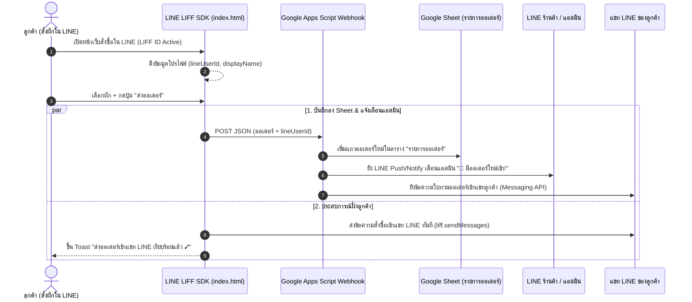

# Design Spec: ระบบบันทึกออเดอร์ Google Sheet & LINE LIFF + Messaging API

**วันที่ออกแบบ**: 9 สิงหาคม 2026  
**อัปเดตล่าสุด**: 9 สิงหาคม 2026 (เชื่อมต่อ LIFF ID: `2011037440-PBPwdRGn` และ Channel Access Token จริงแล้ว)  
**โปรเจกต์**: ระบบสั่งผัก-ผลไม้ออนไลน์ (ร้านสวนผักสด) — `Fang14298/produce-order`  

---

## 1. ภาพรวมและวัตถุประสงค์ (Overview & Goals)

ยกระดับประสบการณ์การสั่งซื้อสินค้าให้เทียบเท่าแอปพลิเคชันระดับมืออาชีพ ด้วยการเชื่อมต่อ **LINE LIFF (LINE Front-end Framework)** และ **LINE Messaging API / LINE Notify**

**เป้าหมายหลัก**:
1. **อัตโนมัติ 100% สำหรับลูกค้า (LINE LIFF)**: เมื่อเปิดหน้าเว็บผ่าน LINE ระบบจะระบุตัวตนของลูกค้า (`lineUserId`, `lineDisplayName`) อัตโนมัติ เมื่อกดสั่งซื้อ ระบบส่งข้อความสั่งซื้อเข้าแชท LINE ของลูกค้าโดยตรงโดยลูกค้าไม่ต้องกดส่งซ้ำ
2. **การแจ้งเตือนเสียงเด้งเข้า LINE แอดมินร้าน (Admin Alert)**: ทันทีที่มีออเดอร์ใหม่ลง Google Sheet ระบบจะยิงข้อความสรุปออเดอร์เด้งเตือนใน LINE ของร้านค้า/กลุ่มแอดมินทันที 24 ชม.
3. **บันทึกตารางรวมศูนย์ (Google Sheet)**: บันทึกข้อมูลออเดอร์ครบถ้วนลงตาราง `"รายการออเดอร์"` ใน Google Sheet พร้อมบันทึก `LINE User ID` สำหรับติดต่อกลับ
4. **จำชื่อร้านค้าในเครื่อง (LocalStorage)**: จำชื่อร้านในโทรศัพท์ลูกค้า ไม่ต้องนั่งพิมพ์ใหม่ทุกครั้ง

---

## 2. สถาปัตยกรรมและการไหลของข้อมูล (Architecture & Data Flow)



---

## 3. รายละเอียดคอนฟิกที่ตั้งค่าแล้ว (Active Configurations)

### 3.1 คอนฟิกในหน้าเว็บ ([`index.html`](file:///C:/Users/fang0/produce-order/index.html))
```javascript
const SHEET_WEBHOOK_URL = "https://script.google.com/macros/s/AKfycbxQ-_TdgdewOhf2f1El9RkjAXcu9DYZMJyQhMNR8gyiQZ96Ce6XD2szlA4wH4nY1bp_Xw/exec";
const SHOP_STORAGE_KEY = "produce_order_shop_name";
const LIFF_ID = "2011037440-PBPwdRGn";
```

### 3.2 คอนฟิกใน Google Apps Script ([`examples/google-apps-script.gs`](file:///C:/Users/fang0/produce-order/examples/google-apps-script.gs))
```javascript
var LINE_CHANNEL_ACCESS_TOKEN = "/ZSNTT8339UJqvXWWQh7fLKBitoZeH7xUFj9+X92XCbewBkFXaUVx8+NZUoUiUMLzvfKu6hLux+EKGFcgtXKtYoLKRJBndcULx1g+EDXdI4NiBdTqNe4U5xEdSmlXJ8oqZrqlYpJumD5w0viHChkPAdB04t89/1O/w1cDnyilFU=";
```

---

## 4. รายละเอียดโครงสร้างข้อมูล JSON Payload

```json
{
  "shop": "ครัวริมปิง",
  "date": "2026-08-10",
  "note": "ขอมะเขือเทศลูกแข็ง",
  "totalAmount": 475,
  "items": [
    { "name": "คะน้า", "qty": 2, "unit": "กก.", "price": 40, "subtotal": 80 },
    { "name": "มะนาว", "qty": 15, "unit": "ลูก", "price": 3, "subtotal": 45 }
  ],
  "itemsSummary": "• คะน้า 2 กก. = 80 บาท\n• มะนาว 15 ลูก = 45 บาท",
  "lineUserId": "U1234567890abcdef1234567890abcdef",
  "lineDisplayName": "Somchai_Restaurant"
}
```

---

## 5. ผลการตรวจสอบความถูกต้อง (Verification)

1. **ตรวจสอบความถูกต้องของไวยากรณ์ JavaScript ใน `index.html`**:
   - ผ่านการตรวจสอบความถูกต้องด้วย Node.js `vm.Script` (Syntax Valid 100%)
2. **การรองรับ Fallback**:
   - หากเปิดผ่านเบราว์เซอร์ปกติภายนอก LINE หน้าเว็บจะสลับไปใช้ระบบส่งข้อความมาตรฐาน (`line.me/R/oaMessage/...`) อัตโนมัติ โดยไม่พังและไม่แสดง Error
