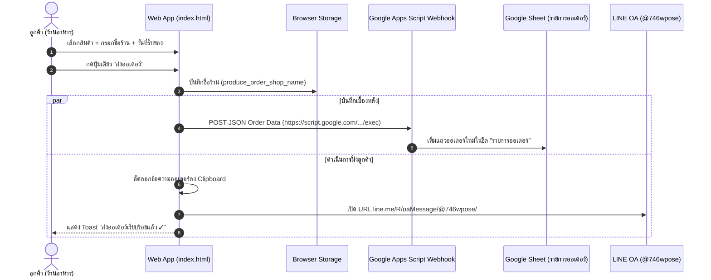

# Design Spec: ระบบบันทึกออเดอร์ลง Google Sheet อัตโนมัติ & จำชื่อร้านค้า (LocalStorage)

**วันที่ออกแบบ**: 9 สิงหาคม 2026  
**อัปเดตล่าสุด**: 9 สิงหาคม 2026 (ปรับปุ่มแอคชั่นเป็นปุ่มเดียว "ส่งออเดอร์" & เชื่อมต่อ Webhook URL จริง)  
**โปรเจกต์**: ระบบสั่งผัก-ผลไม้ออนไลน์ (ร้านสวนผักสด) — `Fang14298/produce-order`  

---

## 1. ภาพรวมและวัตถุประสงค์ (Overview & Goals)

ระบบปัจจุบันได้รับการปรับปรุงจากเดิมที่มี 2 ปุ่ม ("ส่งออเดอร์ทาง LINE" และ "คัดลอกข้อความออเดอร์") รวมเหลือเพียง **ปุ่มเดียวคือ "ส่งออเดอร์"** เพื่อให้การใช้งานของลูกค้าง่ายและกระชับที่สุด

**เป้าหมายหลัก**:
1. **การบันทึกออเดอร์ลง Google Sheet อัตโนมัติ (Dual-Action Webhook)**: เมื่อลูกค้ากดปุ่ม **"ส่งออเดอร์"** ข้อมูลจะถูกส่งไปยัง Google Apps Script Webhook (`https://script.google.com/macros/s/AKfycbxQ-_TdgdewOhf2f1El9RkjAXcu9DYZMJyQhMNR8gyiQZ96Ce6XD2szlA4wH4nY1bp_Xw/exec`) เพื่อเพิ่มแถวในชีต `"รายการออเดอร์"` ทันที
2. **คัดลอกข้อความ + เปิด LINE อัตโนมัติ**: ระบบจะคัดลอกข้อความสรุปออเดอร์ลง Clipboard และเปิดไปยัง LINE OA ร้าน (@746wpose) พร้อมข้อความสั่งซื้อ
3. **จำชื่อร้านค้าในเครื่อง (LocalStorage)**: เมื่อพิมพ์ชื่อร้านครั้งแรก ระบบจะบันทึกจำไว้ ครั้งถัดไปที่ลูกค้ากลับมาใช้งาน หน้าเว็บจะดึงชื่อร้านขึ้นมาให้อัตโนมัติ

---

## 2. สถาปัตยกรรมและการไหลของข้อมูล (Architecture & Data Flow)



---

## 3. รายละเอียดการปรับปรุงระบบ (Detailed Design & Action Buttons)

### 3.1 การปรับปรุงปุ่ม Action Button ใน Modal Sheet
* **ก่อนปรับปรุง**: มี 3 ปุ่ม (`btn-line` ส่ง LINE, `btn-copy` คัดลอกข้อความ, `btn-ghost` ล้างตะกร้า)
* **หลังปรับปรุง**: รวมเหลือ **2 ปุ่ม** เพื่อ UX ที่ดีที่สุด:
  1. `<button class="btn btn-line" onclick="submitOrder()">ส่งออเดอร์</button>` (ปุ่มหลัก)
  2. `<button class="btn btn-ghost" onclick="clearCart()">ล้างตะกร้า</button>` (ปุ่มล้างข้อมูล)

### 3.2 การจัดการ LocalStorage (จำชื่อร้านค้า)
* **กุญแจจัดเก็บ**: `produce_order_shop_name`
* **การทำงาน**:
  * เมื่อเปิดหน้าเว็บ (`init`): ดึงค่าจาก `localStorage.getItem("produce_order_shop_name")` หากมีค่า ให้นำมาใส่ในช่อง `<input id="shop">`
  * เมื่อผู้ใช้พิมพ์ชื่อร้าน หรือกดปุ่ม "ส่งออเดอร์": ทำการ `localStorage.setItem("produce_order_shop_name", shopValue)`

### 3.3 การเชื่อมต่อ Google Apps Script Webhook (`postOrderToSheet`)
* **Webhook URL ที่ใช้งานจริง**:
  ```javascript
  const SHEET_WEBHOOK_URL = "https://script.google.com/macros/s/AKfycbxQ-_TdgdewOhf2f1El9RkjAXcu9DYZMJyQhMNR8gyiQZ96Ce6XD2szlA4wH4nY1bp_Xw/exec";
  ```
* **ฟังก์ชั่น `postOrderToSheet()`**:
  * ส่งข้อมูลแบบ asynchronous POST (`mode: 'no-cors'`) เพื่อบันทึกแถวใหม่ในตาราง Google Sheet `"รายการออเดอร์"`

### 3.4 โครงสร้างข้อมูล JSON ที่ส่งไปยัง Webhook
```json
{
  "shop": "ครัวริมปิง",
  "date": "2026-08-10",
  "note": "ขอมะเขือเทศลูกแข็ง / แบ่งถุงละ 2 กก.",
  "totalAmount": 475,
  "items": [
    { "name": "คะน้า", "qty": 2, "unit": "กก.", "price": 40, "subtotal": 80 },
    { "name": "มะนาว", "qty": 15, "unit": "ลูก", "price": 3, "subtotal": 45 }
  ],
  "itemsSummary": "• คะน้า 2 กก. = 80 บาท\n• มะนาว 15 ลูก = 45 บาท"
}
```

---

## 4. การจัดการข้อผิดพลาดและ Fallback (Error Handling)

1. **กรณีไม่ได้ตั้งค่า Webhook URL หรือเน็ตหลุด**: ใช้ `try...catch` ล้อมการส่ง `fetch()` เพื่อให้การคัดลอกข้อความและการเปิด LINE ทำงานต่อไปได้ราบรื่น ไม่สะดุด
2. **การป้องกัน Validation**: ตรวจสอบช่องชื่อร้าน (ห้ามเป็นค่าว่าง) และวันที่รับของ (ต้องเป็นวันพรุ่งนี้เป็นต้นไป) ก่อนเริ่มทำงานทุกขั้นตอน

---

## 5. แผนการตรวจสอบและผลการทดสอบ (Verification & Testing)

1. **ตรวจสอบไวยากรณ์สคริปต์ (JavaScript Syntax)**:
   - ผ่านการตรวจสอบความถูกต้องด้วย Node.js `vm.Script` (Syntax Valid)
2. **ทดสอบปุ่ม "ส่งออเดอร์"**:
   - กดปุ่มเพียงครั้งเดียว ระบบทำการบันทึกชื่อร้าน -> บันทึกลง Google Sheet -> คัดลอกข้อความ -> เปิดแอป LINE สำเร็จ
