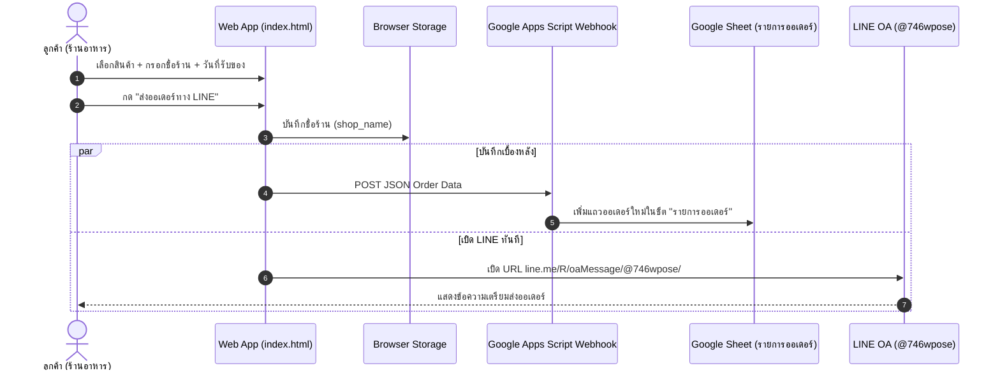

# Design Spec: ระบบบันทึกออเดอร์ลง Google Sheet อัตโนมัติ & จำชื่อร้านค้า (LocalStorage)

**วันที่ออกแบบ**: 9 สิงหาคม 2026  
**โปรเจกต์**: ระบบสั่งผัก-ผลไม้ออนไลน์ (ร้านสวนผักสด) — `Fang14298/produce-order`  

---

## 1. ภาพรวมและวัตถุประสงค์ (Overview & Goals)

ระบบปัจจุบันให้ลูกค้ากดเลือกสินค้าบนหน้าเว็บ `index.html` แล้วสร้างข้อความสั่งซื้อเปิดไปยัง LINE OA (@746wpose) ให้ลูกค้ากดส่งเอง อย่างไรก็ตาม มีโอกาสที่ออเดอร์จะตกหล่นหากลูกค้าไม่ได้กดส่งใน LINE หรือร้านค้าต้องการดูสรุปออเดอร์ย้อนหลังทั้งหมดแบบรวมศูนย์

**เป้าหมายหลัก**:
1. **บันทึกออเดอร์ลง Google Sheet อัตโนมัติ**: เมื่อลูกค้ากดสั่งซื้อ ข้อมูลออเดอร์จะถูกส่งไปยัง Google Apps Script Webhook และบันทึกเข้าชีตตาราง `"รายการออเดอร์"` ใน Google Sheet ทันที
2. **จำชื่อร้านค้าในเครื่อง (LocalStorage)**: เมื่อพิมพ์ชื่อร้านครั้งแรก ระบบจะบันทึกจำไว้ ครั้งถัดไปที่ลูกค้ากลับมาใช้งาน หน้าเว็บจะดึงชื่อร้านขึ้นมาให้อัตโนมัติ ไม่ต้องพิมพ์ซ้ำ
3. **Seamless UX & Non-blocking**: การบันทึกข้อมูลเข้า Google Sheet จะทำงานแบบ Asynchronous อยู่เบื้องหลัง ไม่กระทบความเร็วในการเปิดLINE หรือการทำงานเดิมของลูกค้า

---

## 2. สถาปัตยกรรมและการไหลของข้อมูล (Architecture & Data Flow)



---

## 3. รายละเอียดการปรับปรุงระบบ (Detailed Design)

### 3.1 การจัดการ LocalStorage (จำชื่อร้านค้า)
* **กุญแจจัดเก็บ**: `produce_order_shop_name`
* **การทำงาน**:
  * เมื่อเปิดหน้าเว็บ (`init`): ดึงค่าจาก `localStorage.getItem("produce_order_shop_name")` หากมีค่า ให้นำมาใส่ในช่อง `<input id="shop">`
  * เมื่อผู้ใช้พิมพ์ชื่อร้านหรือกดสั่งซื้อ: ทำการ `localStorage.setItem("produce_order_shop_name", shopValue)`

### 3.2 การเชื่อมต่อ Google Apps Script Webhook (`postOrderToSheet`)
* **ตัวแปร Config**: เพิ่มตัวแปร `const SHEET_WEBHOOK_URL = "...";` ไว้ส่วนบนของสคริปต์ใน `index.html`
* **ฟังก์ชั่น `postOrderToSheet(payload)`**:
  * ใช้ `fetch(SHEET_WEBHOOK_URL, { method: "POST", body: JSON.stringify(payload), headers: { "Content-Type": "text/plain;charset=utf-8" } })`
  * ใช้ `mode: 'no-cors'` หรือจัดการ CORS เพื่อรองรับข้ามโดเมนจาก GitHub Pages ไปยัง Google Apps Script

### 3.3 โครงสร้างข้อมูล JSON ที่ส่งไปยัง GAS Webhook
```json
{
  "shop": "ครัวริมปิง",
  "date": "2026-08-10",
  "note": "ขอมะเขือเทศลูกแข็ง",
  "totalAmount": 475,
  "items": [
    { "name": "คะน้า", "qty": 2, "unit": "กก.", "price": 40 },
    { "name": "มะนาว", "qty": 15, "unit": "ลูก", "price": 3 }
  ],
  "itemsSummary": "• คะน้า 2 กก. = 80 บาท\n• มะนาว 15 ลูก = 45 บาท"
}
```

### 3.4 โครงสร้างคอลัมน์ใน Google Sheet (ชีต "รายการออเดอร์")
| คอลัมน์ | ชื่อหัวตาราง | รายละเอียด / ตัวอย่าง |
|---|---|---|
| A | เลขที่ออเดอร์ | ORD-20260809-123000 |
| B | วัน-เวลาสั่งซื้อ | 09/08/2026 12:30:00 |
| C | ชื่อร้าน / ลูกค้า | ครัวริมปิง |
| D | วันที่รับของ | 2026-08-10 |
| E | รายการสินค้าที่สั่ง | คะน้า 2 กก. (40฿), มะนาว 15 ลูก (3฿) |
| F | ยอดรวม (บาท) | 475 |
| G | หมายเหตุ | ขอมะเขือเทศลูกแข็ง |
| H | สถานะ | รอยืนยัน |

---

## 4. การจัดการข้อผิดพลาดและ Fallback (Error Handling)

1. **กรณีไม่ได้ตั้งค่า Webhook URL**: หาก `SHEET_WEBHOOK_URL` เป็นค่าว่าง ระบบจะบันทึกเฉพาะ `localStorage` และเปิด LINE ตามปกติโดยไม่เกิด Error
2. **กรณีอินเทอร์เน็ตหลุด/GAS Webhook ขัดข้อง**: ใช้ `try...catch` ล้อมการส่ง `fetch()` เพื่อให้ฟังก์ชั่นเปิด LINE และคัดลอกข้อความทำงานได้เสมอ แม้ระบบบันทึกชีตจะขัดข้อง

---

## 5. แผนการตรวจสอบและทดสอบ (Verification Plan)

1. **ทดสอบ LocalStorage**:
   - กรอกชื่อร้าน พิมพ์ "ครัวสวนผัก" กดส่งออเดอร์ แล้วกด Refresh หน้าเว็บ
   - ตรวจสอบว่าช่อง "ชื่อร้าน / ลูกค้า" แสดงคำว่า "ครัวสวนผัก" อัตโนมัติหรือไม่
2. **ทดสอบการบันทึกเข้า Google Sheet**:
   - จำลองการกดส่งออเดอร์
   - ตรวจสอบใน Google Sheet ว่ามีชีต "รายการออเดอร์" ถูกสร้างขึ้นและมีข้อมูลออเดอร์ใหม่เพิ่มขึ้น 1 แถวถูกต้องหรือไม่
3. **ทดสอบบนอุปกรณ์จริง (Mobile & Desktop)**:
   - ทดสอบเปิด LINE บนมือถือ iOS / Android ว่ายังคงเด้งเข้าแชทร้าน @746wpose พร้อมข้อความเรียบร้อย
